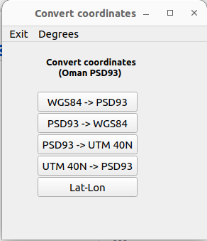
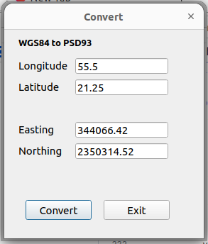
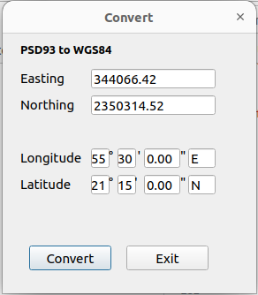

# Convert coordinates (PSD93 Oman)

A little app in pyqt to make conversions from geopraphic (WGS84) and PSD93 projection and UTM 40N. 







App written in Python 3.10 with dependencies in `requirements.txt`


Instructions to install (Linux)
```
$git clone https://github.com/bvermeulen/convert_coordinates.git
$cd convert_coordinates
$python -m venv ./venv
$source ./venv/bin/activate
$pip install -r requirements.txt
$python convert_coords_pyqt.py
```
